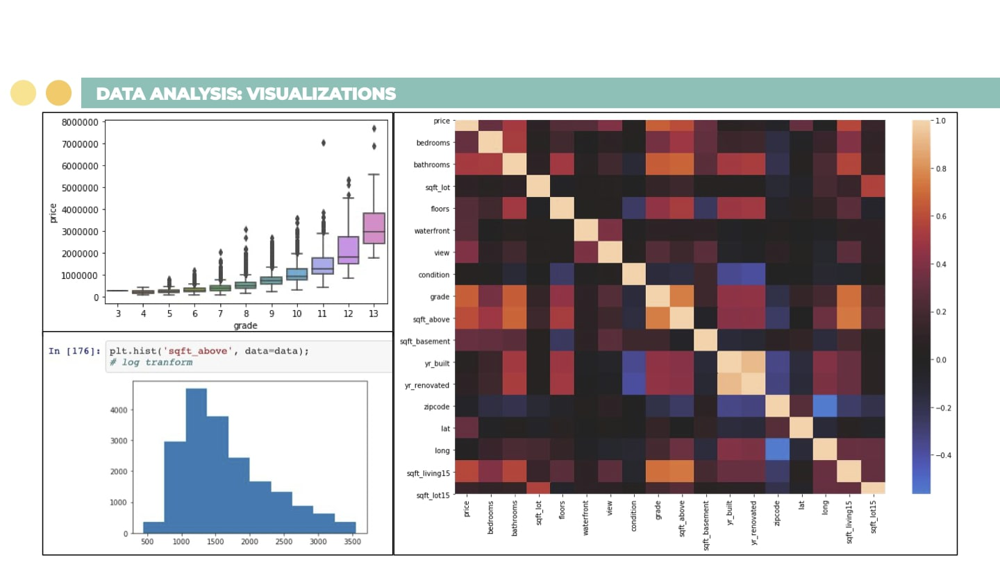
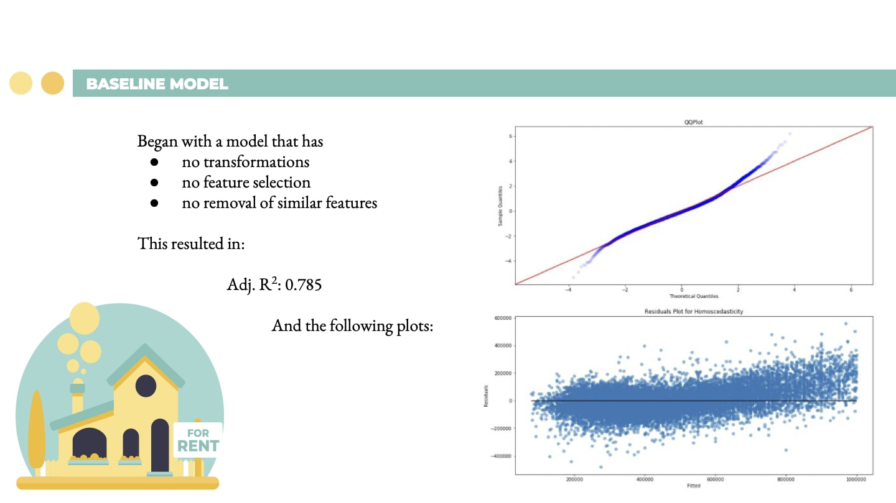
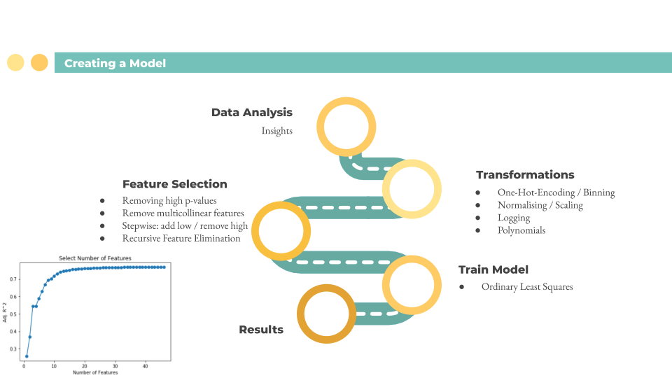
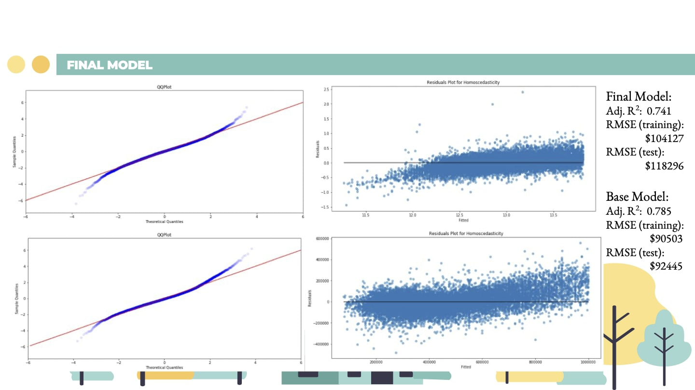
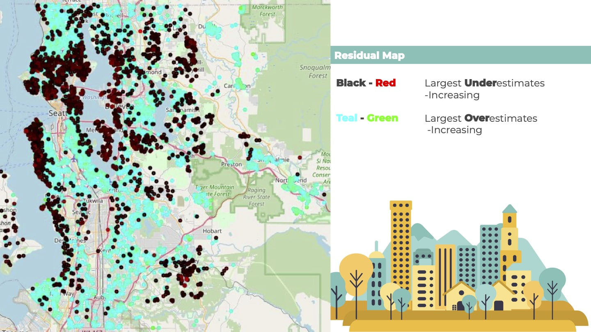
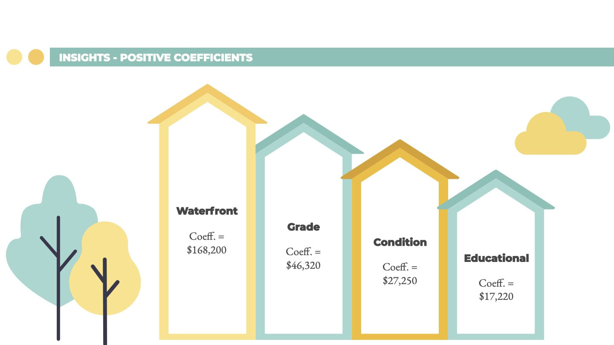
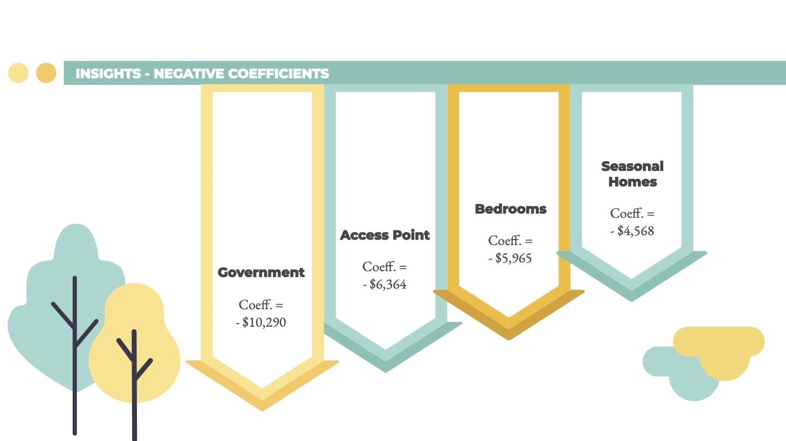
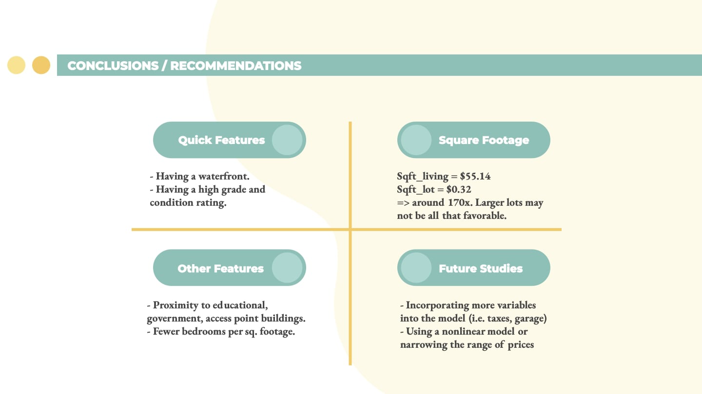

# Phase2_Project
Project for Flatiron School: Kings County Housing Data

## Members
Project members: TaeJoon Kim and Matthew Andrews

## Overview/Business Problem
A real estate firm needs a reliable model to predict house prices based on its features. With an accurate estimate, the firm can quickly identify underpriced houses to invest in and generate the maximum amount of profit upon resale.

## Preview of Results
- The variable with the highest effect on house prices was ‘waterfront.’
- Proximity to places like schools or government buildings had a notable impact on house prices as well.
- The model was not perfectly linear, due to high range of house prices that were included in the model.

## Data
Initial data contained data on 21,597 houses sold in Kings Country in 2014 and 2015.

### Column Names and descriptions for Kings County Data Set:
* id - Unique identifier for the house
* date - Date that the house was sold
* price - Price of the house ( prediction target )
* bedrooms - Number of bedrooms
* bathrooms - Number of bathrooms
* sqft_living - Square footage of the home
* sqft_lot - Square footage of the lot
* floors - Number of floors (levels) in the house
* waterfront - Houses with a waterfront view
* view - House view count
* condition - How good the condition is ( Overall )
* grade - Overall grade given to the housing unit, based on King County grading system
* sqft_above - Square footage of house apart from basement
* sqft_basement - Square footage of the basement
* yr_built - Year that the house was built
* yr_renovated - Year that the house was renovated
* zipcode - Zip code
* lat - Latitude coordinate
* long - Longitude coordinate
* sqft_living15 - The square footage of interior housing living space for the nearest 15 neighbors
* sqft_lot15 - The square footage of the land lots of the nearest 15 neighbors

### Kings Country GIS Data (Data from https://gis-kingcounty.opendata.arcgis.com)
Latitude and Longitude of:
* Airports
* Cemeteries
* Commercial Farms
* Places of Culture
* Places of Education
* Fire / Police Station
* Gated Residential Areas
* Public Gathering Spaces
* Utilities

## Problem-solving Process

To create a model:      
Taking the insights gained from the Data Analysis, along with some experiments, I performed various transformations: binning lat/longs and one-hot-encoding, altered minmax scaling, logging, finding polynomial terms.       
And then, with these newly calculated Features I whittled them down. In turn removing the features with high p-valuues, and multicollinear terms.    
The last step, for feature selection, was to use Recursive Feature Selection to check how well a model would work with different amounts of the best features. I made a graph from this and used it to help decide the number of features I wanted: The point where adding a single feature no longer made a significant impact; So as not to overfit.    
I then train the model and get the results.
This was done several times, altering the order of different transformations or selections, 'til I settled on one:     

By this model’s R^2 we see that it explains 74.1% of the differences in house price. Less than the baseline model, but with fewer features, less likely to be overfit.    
As a final test, I measured the model’s RMSE for the train and test data. I then measured the RMSE for the base model as well.      
The final model does have a slightly better qqplot: adhering to the red lineup to ~2.5, rather 2. 
The residual plot is certainly different with a negative tail to the left, and rising gradually as it heads to the right.
But with an average error of less than $93000, and time running short we went forward with the base model.       

The data we have can only do so much. It doesn’t tell us what the neighbours are like, 	if a place has become fashionable, 	or maybe an area... just smells.       
And as a Real Estate Firm it’s essential to remember: Location, Location, Location.

This shows, in the black, increasing to red, the areas where the model most underestimated the price, relative to the price.       
And in the cyan, increasing to green, the most overestimated prices       
The clearest, most solid section we can see is the cyan in the North. But there are some fairly clear divisions elsewhere too, like near the Delridge area inset.        
Now we can’t identify why; But we can identify areas where adjustments may need to be considered when estimating house prices

Other future work:
* Try some more minor changes to the base model e.g. some transforms, without feature selection     
* Add cross validation
* Look further into PCA
* Add sklearn metric into RFE function
* Find how to get more data from the API
* Try changing the bedrooms / bathrooms / sqft_living into number_of_rooms, sqft_per_room
* If we could get the same data over a longer time, it would be interesting to see how the error map changes
* Try a narrower range of prices

## Contact us:
TaeJoon Kim (tjkim614@gmail.com)
Matthew Andrews (2maltanno@gmail.com)
